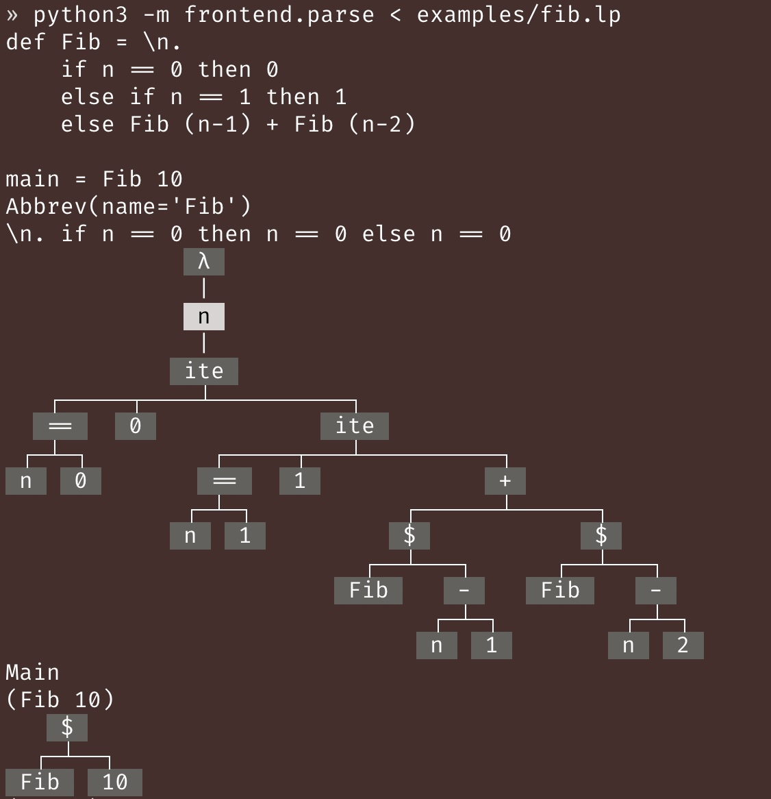

# CS 162 - Homework 2

> Written problems due: **Thursday, July 10, 2025, 12:30pm (before class)**
> 
> Coding problems due: **Thursday, July 10, 2025, 11:59pm PDT** on Gradescope

## Instructions
There are be 2 types of problems:
1. **Written problems** are marked with ✍️.
   - Must be done **individually**.
   - Please turn in a **stapled, physical copy** of your solutions before the lecture start time on the due date.
   - For each sub-problem, please provide a self-grade out of 2 points: 2 for a fully solved problem with a correct solution, 1 for a partially correct attempt with all work shown, and 0 for no attempt. If you're unsure whether your solution is correct, you can leave it as `?`, and I will grade it for you.
   - On the first page of your solutions, please include your name (on Canvas/Gradescope), student ID, and a table containing the self-grades for each sub-problem, like this:

    | Problem | Sub-problem | Self-grade (0/1/2/?) |
    | ------- | ----------- | -------------------- |
    | 1       | A           | 2                    |
    | 1       | B           | 2                    |
    | 1       | C           | 1                    |
    | 1       | D           | ?                    |

    - If you handwrite your solutions, please write clearly and legibly.


2. **Coding problems** are marked with 🧑‍💻.
   - Must be done **individually**.
   - Coding problems are autograded on Gradescope.
   - You can submit as many times as you want.
   - Note that you can use a maximum of 2 late days for each HW's coding problems, but not for the written problems.


Other important notes:
- Problems (written or coding) marked with ⭐️ are extra credit problems. You can do them for fun and for extra credit, but they are completely optional.

- You're encouraged to talk about the problems with the instructor, the TA, and your classmates, but your group must write up your own solutions for the written problems, and you must individually write code for the coding problems.

- Note you won't be able to turn in corrections to homework problems, unlike quizzes.

- Use of generative AI tools and coding assistants is not allowed for this assignment. You will be able to use them for future assignments (maybe), but not for this one. If you're new to Python, it's ok ask LLMs to answer some concept questions, but please write your own code (since LLMs won't be able to help you anymore in future assignments which are harder + not in their training data).

- If you have any questions about the assignment, please post them in the `#hw2` Discord channel, or come to the office hours.


## Part 1 - Implementing the Lamp Interpreter

This is where the fun begins in CS 162! We'll start designing and implementing a language called lamp (short for "**lam**bda calculus **p**lus a bunch of other stuff"). 


In this HW, lamp will have simple features like arithmetic, booleans, let-bindings, and lambda calculus. The manual for lamp can be found [here](../../lamp.md).

You should read the manual carefully before proceeding with the assignment, since it contains important information about the syntax (both concrete and abstract) and the operational semantics of the language. Most of the manual should be familiar to you from the lectures, but we did add some new features (to make it slightly more exciting), so please read the manual carefully.

---
Assuming you have read the manual, let's break down the code for implementing lamp.

To fully implement a language, we need a lot of components, including:
1. A representation of the ASTs in the meta language (Python).
2. A parser frontend that takes a text file containing lamp code, and produces an AST.
3. An interpreter backend that takes the AST and evaluates it, producing a value or an error.
4. And more (to be added in future assignments).

Luckily, the first two components are already implemented for you, so you can focus on the interpreter backend. You can download the starter code using [this link](./hw2-starter.zip). The structure of the starter code is as follows:

<details>
<summary>examples/</summary>

  - `fib.lp` is an example lamp program that computes the Fibonacci numbers.

</details>

<details>
<summary>frontend/</summary>

  - `lang.py` contains the abstract syntax tree (AST) for lamp. The representation is the same as what we discussed in class (using Python's `dataclass`). 
    - Please read through the docstrings of the classes to understand the structure of the AST.
    - If a class deserves additional explanation, you can find it in the docstring of the class.
    - You should ignore all the `__repr__` and `__pdoc__` methods, since they're just for pretty-printing the AST.
  - `grammar.lark` contains the CFG for the concrete syntax of lamp.
    - You do not need to understand anything in this file.
  - `parse.py` implements the parser for lamp.
    - You do not need to understand anything in this file.
    - However, I wrote some code to print out lamp expressions as strings or as ASTs. If you run the parser independently on an lamp file, it will print out the string & the AST for every definition and for the main expression. To do this, run this command:
      ```bash
      python3 -m frontend.parse < examples/fib.lp
      ```
      You should see the output like this:
        


  - `pretty_ast.py` is a pretty-printer for lamp ASTs.
    - You do not need to understand anything in this file.
    - However, you might find it helpful to pretty-print the ASTs when you're debugging your interpreter. The function `pp_ast(e)` takes an expression `e`, and returns a (large) string that shows the AST of `e` in a human-readable format.

</details>

<details>
<summary>backend/</summary>

  - `subst.py` contains a skeleton of the substitution function.
    - **Your task** will be to fill in places marked with `# your code here`.
  - `eval.py` contains a skeleton of the interpreter.
    - **Your task** will be to fill in places marked with `# your code here`.
    - Since an interpreter needs to evaluate expressions into *values*, we need to represent values in Python. The representation of values is very similar to that of `Expr`: we have an empty dataclass `Val`, and subclasses `VNat`, `VBool`, and `VLambda` for natural numbers, booleans, and lambda functions, respectively. If you read the operational semantics section of the lamp manual, you will see a grammar for values, which directly maps to the following Python code:
      ```python
      @dataclass
      class Val:
          pass

      @dataclass
      class VNat(Val):
          n: int

      @dataclass
      class VBool(Val):
          b: bool

      @dataclass
      class VLambda(Val):
          b: Binder[Expr]
      ```
    - The interpreter is implemented as an `Interpreter` class that has a field `prog` that contains the lamp program to be evaluated (recall that a lamp program has a list of abbreviations and a main expression).
    - The `run` method of the `Interpreter` class evaluates the main expression of the program, which in turn runs `eval` on the main expression.
    - The `eval` function is where you will translate the operational semantics of lamp into Python code.

</details>

To run the interpreter, you can run the following command:
```bash
python3 -m backend.eval < examples/fib.lp
```
You should see the output like this:
```
def Fib = \n.
  if n == 0 then 0
  else if n == 1 then 1
  else Fib (n-1) + Fib (n-2)

main = Fib 10
Result: VNat(n=55)
```

### Problem 0
Let's first set up the Python environment for this assignment.
1. If you used `conda` to set up the Python environment for this class, you should do `conda activate cs162` to activate the environment.
2. Then, run `python3 -m pip3 install requirements.txt` to install the required packages.

Once step 2 is done, include a screenshot of the terminal output in your PDF submission, showing that the packages were installed successfully.

If you have trouble installing the packages, please ask for help in the `#tech-support` channel on Discord.


### Problem 1

Before you put on the language implementer hat, let's have you be the programmer who uses the lamp language. For each of the following sub-problems, define a lamp abbreviation (`def AbbrevName = <expr>`). You can create a file called `stdlib.lp`, and put all of your definitions there. Once you're done, make sure to copy and paste the content of `stdlib.lp` into your written solutions.

To validate your answers, I uploaded a reference interpreter for lamp to CSIL (TODO for Junrui: upload this by Friday). If you log into CSIL, you can access it via
```bash
~junrui/lamp < FILENAME
```

Each item in the following list is worth 2 points as usual.


1. Define an abbreviation `def Not = \b. <your code here>` that takes a boolean value and returns its negation. Hint: use `if b then .. else ..`.
2. Define an abbreviation `def And = <your code here>` that takes two booleans and returns their conjunction.
3. Define an abbreviation `def Or = <your code here>` that takes two booleans and returns their disjunction.
4. Define an abbreviation `def Leq = <your code here>` that takes two natural numbers and returns whether the first number is less than or equal to the second number. Hint: use `if`, `==` and recursion.
5. Define an abbreviation `def Lt = <your code here>` that takes two natural numbers and returns whether the first number is less than the second number. Use `Not` and `Leq`.
6. Define an abbreviation `def Div = \m. \n. <your code here>` that takes two natural numbers and returns the result of dividing `m` by `n`. If `n` is zero, you can simply crash the program using something like `1+True`. (We'll learn how to design proper error handling next week.)
7. Define an abbreviation `def Mod = \m. \n. <your code here>` that takes two natural numbers and returns the result of `m` modulo `n`. Hint: use `Div` and `*`.
8.  Define an abbreviation `def CollatzStep = \n. <your code here>` that takes a natural number `n` and returns the next step in the Collatz conjecture sequence. If `n` is even, return `Div n 2`, otherwise return `3 * n + 1`.
9.  Define an abbreviation `def Collatz = \n. <your code here>` that takes a natural number `n` and counts the number of steps it takes for the sequence starting at `n` to reach `1`. If `n` is `1` or `0`, simply return `0`.

> Hopefully, the last sub-problem can convince you that lamp is basically Turing-complete (woo-hoo), since the Collatz conjecture (that every sequence terminates in finite amount of steps) is an open problem. 
> 
> This is just to show you that we've already got a really powerful yet conceptually simple language to work with this early in the course! Can you imagine what exciting features we're gonna add in future HW? Stay tuned!

### Problem 2

I claimed in class that lambda calculus is all you need -- you don't need booleans, nat, or recursion. In this exercise, I'm going to show you some mystery lambda functions that substantiate my claims.

#### Problem 2-A (✍️ written, 2 pts)
We will encode a boolean as a lambda function that takes two arguments, and returns one of them:
```
def T = \x. \y. x
def F = \x. \y. y
```
That is, `T` is a function that takes two arguments and returns the first one, while `F` is a function that takes two arguments and returns the second one.
```
def MysteryIf = \cond. \thn. \els. cond thn els
```
I claim that `MysteryIf` implements if-then-else using pure lambda calculus: the function takes three arguments: a condition (which is an *encoding* of booleans, not a native boolean), and two arbitrary expressions, and returns one of the two expressions based on whether the condition encodes true or false.

Your task is to define 
```
def MysteryAnd = \b1. \b2. <your code here>
def MysteryOr = \b1. \b2. <your code here>
```
which *encodes* conjunction and disjunction. You should only call `MysteryIf`, `T` and `F` in your code (don't use native booleans or native if-then-else).

Once you're done, it's time to check that our encodings are correct. To do so, we define functions that
1. take a native boolean and return the corresponding encoding
2. take an encoding and return the corresponding native boolean.
```
def EncodeBool = \b. if b then T else F
def DecodeBool = \enc. enc True False
```

Now, you should check that `DecodeBool (MysteryAnd (EncodeBool b1) (EncodeBool b2))` gives the expected answer for any choice of native booleans `b1` and `b2`. Similarly, check that `DecodeBool (MysteryOr (EncodeBool b1) (EncodeBool b2))` gives the expected answer for any choice of native booleans `b1` and `b2`. You can change the `main` expression to test one case at a time.

In your PDF, include the output of `DecodeBool (MysteryAnd (EncodeBool b1) (EncodeBool b2))` and `DecodeBool (MysteryOr (EncodeBool b1) (EncodeBool b2))` for all combinations of `b1` and `b2` being `True` or `False`.

> This exercise shows you that any combinatorial logic circuit can be encoded in pure lambda calculus.


#### Problem 2-B (✍️ written, 2 pts)

Now, let's encode natural numbers. You do not need to write any code. Simply copy and paste the following code into a test file:
```
def Z = \b. \i. b
def S = \n. \b. \i. i n (n b i)
def MysteryAdd = \m. m (\n. n) (\_. \r. \n. S (r n))
def MysteryMul = \m. m (\_. Z) (\_. \r. \n. MysteryAdd n (r n))
def EncodeNat = \n. if n == 0 then Z else S (EncodeNat (n-1))
def DecodeNat = \n. n 0 (\_. \r. r + 1)
```

Then, run `DecodeNat (Mystery Add (EncodeNat 10) (EncodeNat 20))` and `DecodeNat (Mystery Mul (EncodeNat 10) (EncodeNat 20))`. You should see the expected results of `30` and `200`, respectively. In your PDF, simply include the output of evaluating these two expressions.

> Magic, isn't it? We'll learn how these encodings work very soon. Stay tuned!
>
> Hopefully, Problem 2-A and 2-B convinced you that all you really need is just lambda calculus.
>
> 

### Problem 3 (🧑‍💻 coding, 10 pts)
Finish the substitution function in `subst.py`.

### Problem 4 (🧑‍💻 coding, 20 pts)
Finish the interpreter in `eval.py`.


## Part 2 - Conceptual Questions

### Problem 1 (✍️ written, 2 pts)
Draw the abstract binding tree (ABT) for the lamp expression `\n. \b. \i. i n (n b i)`.

### Problem 2 (✍️ written, 2 pts)
Draw the derivation tree for the evaluation of lamp expression `let x = (let x=1 in x+1) in let x = x+1 in x+1`. If the tree is too large, you can divide it into several parts and connect them with arrows.

### Problem 3 (✍️ written, 2 pts)
In class, I said the correct rule for application should be:
```
e1 => \x. e
e2 => v
( [v/x]e = e' )
e' => v'
---------------
e1 e2 => v'
```

An alternative rule is to require `e1` to *be* a lambda function, instead of evaluating it *to* a lambda function:
```
e1 = \x. e
e2 => v
( [v/x]e = e' )
e' => v'
---------------
e1 e2 => v'
```

Construct a lamp expression that evaluates successfully using the first rule, but fails to evaluate using the second rule.

<details>
<summary>Hint</summary>
Try using a "multi-argument" function.
</details>


### Problem 4 (✍️ written, 2 pts)

Design the call-by-name (CBN) version of the rule for evaluating applications. Construct the following lamb expressions (if you think no such expression exists, please explain why):
- an expression such that using the CBN rule evaluates it to a value, but the call-by-value (CBV) rule does not
- an expression such that using the CBV rule evaluates it to a value, but the CBN rule does not
- an expression such that using the CBN and the CBV rule evaluates it to different values
- an expression such that using either the CBN or the CBV rule evaluates it to the same value, but the CBV rule results in a smaller derivation tree (i.e., fewer total number of rules used) than the CBN rule
- an expression such that using either the CBN or the CBV rule evaluates it to the same value, but the CBN rule results in a smaller derivation tree than the CBV rule.

### Problem 5 (✍️ written, 2 pts)

We say a program is well-scoped if it has no free variables. Show that determining whether a lamp expression is well-scoped is decidable.

<details>
<summary>Hint</summary>

Define a recursive function called `free_vars` that takes a lamp expression and returns the set of all free variables in the expression. Once you collected all free variables, check if the set is empty.

</details>

### Problem 6 (✍️ written, ⭐️extra credit⭐️, 2 pts)

Function parameters in Python are lexically scoped. However, variables are weird. For example, consider the following Python code:
```python
if <condition>:
    x = 1
else:
    pass
print(x)
```
If the condition holds, the first branch is executed, and `1` will be printed. Otherwise, the second branch is executed, and the above code will raise `NameError: name 'x' is not defined`.

We say a Python program is well-scoped if it will not raise a `NameError` when executed. Show that determining whether a Python program is well-scoped is undecidable by reducing the halting problem to it../