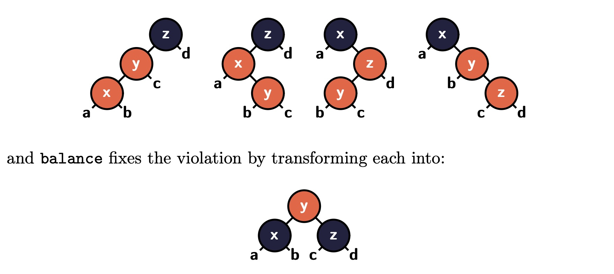

# CS 162 - Homework 4
 
> Due: **Sunday, Aug 3rd, 2025, 11:59pm PDT** on Gradescope

## Instructions

> The entirety of this homework can be done in pairs if you want to.

There are be 2 types of problems:
1. **Written problems** are marked with ✍️.
   - Must be done **individually**.
   - Please submit a PDF of your solutions to Gradescope.
   - For each sub-problem, please provide a self-grade out of 2 points: 2 for a fully solved problem with a correct solution, 1 for a partially correct attempt with all work shown, and 0 for no attempt. If you're unsure whether your solution is correct, you can leave it as `?`, and I will grade it for you.
   - On the first page of your solutions, please include your name (and your partner's), and a table containing the self-grades for each sub-problem, like this:

    | Problem | Sub-problem | Self-grade (0/1/2/?) |
    | ------- | ----------- | -------------------- |
    | 1       | A           | 2                    |
    | 1       | B           | 2                    |
    | 1       | C           | 1                    |
    | 1       | D           | ?                    |

    - If you handwrite your solutions, please write clearly and legibly.


2. **Coding problems** are marked with 🧑‍💻.
   - Coding problems are autograded on Gradescope.
   - You can submit as many times as you want.
   - No late days are allowed for coding problems since I need to submit your grades to GOLD.


Other important notes:
- Problems (written or coding) marked with ⭐️ are extra credit problems. You can do them for fun and for extra credit, but they are completely optional.

- You're encouraged to talk about the problems with the instructor, the TA, and your classmates, but you must write your own solutions.

- Note you won't be able to turn in corrections to homework problems, unlike quizzes.

- Use of generative AI tools and coding assistants is not allowed for this assignment. 

- If you have any questions about the assignment, please post them in the `#hw4` Discord channel, or come to the office hours.


## Part 1 - Programming in Lamp

Download the starter code from [here](./hw4-starter.zip).


Carefully read the updated [Lamp Reference Manual](../lamp.md). Again, a reference implementation of Lamp is available on CSIL as `~junrui/lamp` (for evaluation) and `~junrui/lamp-ty` (for typing). Please use them to test your Lamp programs.

Before you jump into coding, let us explain some new shiny concrete syntax added to Lamp:

- (Recursive) type equations are written as
    ```lamp
    type <TypeName> = <Type>
    ```
    where `<TypeName>` is the name of the type (a global variable, so needs to be capitalized), and `<Type>` is the type that the name is defined to be equal to.
    For example, the natural number type is defined as:
    ```lamp
    type Nat = +{ 'zero: (), 'succ: Nat }
    ```
- Just like abbreviations, type equations can be mutually recursive, since type names have global scope.

- The elimination form for product types is provided as a syntactic sugar:
    ```
    let (x1, ..., xn) = e1 in e2
    ```
    which is desugared by the parser into:
    ```
    match e1 {
        (x1, ..., xn): e2
    }
    ```

- The elimination form for sum types is provided as a syntactic sugar:
    ```
    switch e1 {
        'l1 x1: e1,
        'l2 x2: e2,
        ...
    }
    ```
    which is desugared by the parser into:
    ```
    match e1 {
        'l1 x1: e1,
        'l2 x2: e2,
        ...
    }
    ```

- 1-tuples are automatically unpacked, so
  - `(1)` is parsed into a number, instead of a 1-tuple that contains the number.
  - `(Nat)` is parsed into the type `Nat`, instead of a 1-tuple that contains the type `Nat`.
  - `(x)` is parsed into the pattern variable `x`, instead of a 1-tuple pattern that contains the variable `x`.


- In injection expressions and injection patterns where the contained expression/pattern is the unit `()`, you can use `'<label>` instead of `'<label> ()`. For example, if we define the custom Boolean type as:
    ```lamp
    type MyBool = +{ 'true: (), 'false: () }
    ```
    then we can write the injection expression as:
    ```lamp
    'true
    ```
    and define the negation function as:
    ```lamp
    def Not: MyBool -> MyBool = \b.
        switch b {
            'true: 'false,
            'false: 'true
        }
    ```
    instead of the more verbose:
    ```lamp
    def Not: MyBool -> MyBool = \b.
        switch b {
            'true (): 'false (),
            'false (): 'true ()
        }
    ```

- It is quite common to define a function that takes an argument and immediately pattern matches on it. In this case, you can use the following syntactic sugar:
    ```lamp
    def MyNot: MyBool -> MyBool = \{
        'true: 'false,
        'false: 'true
    }
    ```
    which is desugared by the parser into:
    ```lamp
    def MyNot: MyBool -> MyBool = \_arg.
        switch _arg {
            'true: 'false,
            'false: 'true
        }
    }
    ```


> For all problems in Part 1 (this part) of the HW, please use the reference implementation to check if the Lamp programs you wrote are correct or not!!! You'll need to use them as test cases for Part 2 (implementing the Lamp language).


### Problem 1 (✍️ written, 2 pts)
1. Define `MaybeNat` as a sum type with the following constructors:
   - `'none` for representing failure,
   - `'some` for representing a successful result that contains natural number.
2. Using the unsafe division you wrote in HW2, implement a function `SafeDiv` that takes two natural numbers and returns a `MaybeNat`. If the second number is zero, it should return `'none`, otherwise it should return `'some` with the result of the division.
3. Using `SafeDiv`, implement a function `SafeMod` that takes two natural numbers and returns a `MaybeNat`. If the second number is zero, it should return `'none`, otherwise it should return `'some` with the result of the modulo operation. 
4. Define `MyBool` a recursive sum type with the following constructors:
   - `'true` for true,
   - `'false` for false.
5. Define a function `MyBool2Bool` that takes a `MyBool` and returns a `Bool`. The function should return `True` for `'true` and `False` for `'false`.
6. Define funtions `MyAnd` and `MyOr` that take two `MyBool`s and return a `MyBool`. You should use pattern matching. For each function, the match should have no more than two branches. *Hint*: combine tuple patterns with sum type patterns.
7. Define a type `MyNat` as a recursive sum type with the following constructors:
   - `'zero` for zero,
   - `'succ` for the successor of a natural number.
8. Define a function `MyAdd` that takes two `MyNat`s and returns a `MyNat`. You should use pattern matching. The match should have no more than two branches.


### Problem 2 (✍️ written, 2 pts)
Pick either this problem, or Problem 3. You do not need to do both, although you are more than welcome to.
1.  Define the `List` type as a recursive sum type with the following constructors:
   - `'nil` for the empty list,
   - `'cons` for a non-empty list that contains a head element (`Nat`) and a tail (`List`).
2. Define a function `def Incr: Nat -> List -> List` that takes a `Nat` and a `List`, and returns a new `List` where each element of the original list is incremented by the given `Nat`. 
3. Define a function `def Len1: List -> Nat` that takes a `List` and returns the length of the list as a `Nat`. This function should be recursively, and should not call any other helper function. This function will visit each element exactly twice: once before the recursive call and once after the recursive call.
4. Define a function `def Len2: List -> Nat` that takes a `List` and returns the length of the list. The function should visit each element exactly once. *Hint:* define `LenAcc: Nat -> List -> Nat` that takes an accumulator `Nat` and a `List`, where the accumulator is the length of the list so far. Then call `LenAcc` with an initial value of zero in `Len2`.
5. Define a function `def Sum1: List -> Nat` that takes a `List` of `Nat`s and returns the sum of the elements as a `Nat`. This function should be recursively, and should not call any other helper function.
6. Define a function `def Sum2: List -> Nat` that takes a `List` of `Nat`s and returns the sum of the elements as a `Nat`. The function should visit each element exactly once. *Hint:* define `SumAcc: Nat -> List -> Nat` that takes an accumulator `Nat` and a `List`, where the accumulator is the sum of the elements so far. Then call `SumAcc` with an initial value of zero in `Sum2`.
7. Define a function `def Max1: List -> MaybeNat` that takes a `List` of `Nat`s and returns the maximum element as a `MaybeNat`. If the list is empty, it should return `'none`, otherwise it should return `'some` with the maximum element. This function should be recursively, and should not call any other helper function.
8. Define a function `def Max2: List -> MaybeNat` that takes a `List` of `Nat`s and returns the maximum element as a `MaybeNat`. The function should visit each element exactly once. *Hint:* define `MaxAcc: Nat -> List -> Nat` that takes an accumulator `Nat` and a `List`, where the accumulator is the maximum element found so far. Then, in `Max2`, pattern match on the input list. If it is empty, return `'none`, otherwise call `MaxAcc` with the first element as the initial value of the accumulator.
9. Define a function `def Rev1: List -> List` that takes a `List` and returns a new `List` that is the reverse of the original list. *Hint:* define a helper function `RevAcc: List -> List -> List` that takes an accumulator `List` and a `List`, where the accumulator is the reversed list so far. Then call `RevAcc` with an initial value of `'nil` in `Rev1`.
10. Define a function `def Append: List -> List -> List` that takes two `List`s and returns a new `List` that is the concatenation of the two lists. You should use recursion + post-order traversal.
11. Define a function `def Rev2: List -> List` that takes a `List` and returns a new `List` that is the reverse of the original list. This function should be recursively, and should not call any other helper function except for `Append`.

### Problem 3 (✍️ written, 2 pts)
Pick either this problem, or Problem 2. You do not need to do both, although you are more than welcome to.
1. Define a type `Tree` as a recursive sum type with the following constructors:
   - `'leaf` for a leaf node that contains a natural number,
   - `'node` for an internal node that contains a natural number and two subtrees.
2. Define a function `def Search: Nat -> Tree -> MaybeNat` that takes a natural number and a `Tree`, and returns a `MaybeNat`. If the number is found in the tree, it should return `'some` with the number, otherwise it should return `'none`. You should *not* assume that the tree is a binary search tree.
3. A [red-black tree](https://en.wikipedia.org/wiki/Red%E2%80%93black_tree) is a binary search tree where each node can be either red or black (if you never learned red-black trees in your data structures course, you can watch a quick YouTube video like [this one](https://www.youtube.com/watch?v=qvZGUFHWChY)). In Lamp, we can represent a red-black tree as a recursive sum type with the following constructors:
    ```
    rec RBTree = +{
        'leaf: (),
        'r: (Nat, RBTree, RBTree),
        'b: (Nat, RBTree, RBTree)
    }
    ```
    Additionally, a red-black tree should satisfy the following invariants:
    1. There are no two red nodes in a row.
    2. Every path from the root to a leaf has the same number of black nodes.
    
    To insert a number into a red-black tree, simply treat the tree as a binary search tree (so use each node to decide which subtree to go to):
    ```
    def Insert: Nat -> RBTree -> RBTree = \x. \t.
      match t {
       'leaf: 'r (x, 'leaf, 'leaf),
       'r (y, l, r):
           if x == y then t
           else if Lt x y then Balance ('r (y, Insert x l, r))
           else Balance ('r (y, l, Insert x r)),
       'b (y, l, r):
           if x == y then t
           else if Lt x y then Balance ('r (y, Insert x l, r))
           else Balance ('r (y, l, Insert x r))
    }
    ```
    (You need to copy over your `Lt` function from HW2.)
    
    After the inserting the number, the first invariant may be violated (the second invariant will still hold). So we need to call a `Balance` function to fix the tree. The `Balance` function should take a red-black tree that may violate the first invariant, and return a new red-black tree that satisfies both invariants. The balance function is illustrated in the following diagram. There are 4 cases to consider:
    
    

    Your task is to implement the `Balance` function:
    ```
    def Balance: RBTree -> RBTree = \{
        <pattern 1>: <result tree>,
        <pattern 2>: <result tree>,
        <pattern 3>: <result tree>,
        <pattern 4>: <result tree>,
        t: t
    }
    ```
    Each pattern should describe one of the 4 cases where the tree violates the first invariant (as illustrated in the topf half of the diagram above), and the result tree in all branches should be the red-black tree that no longer violates the first invariant (as illustrated in the bottom half of the diagram above). The last branch `t: t` simply matches any tree that does not violate the first invariant, and returns it unchanged.


## Part 2 - Implementing the Lamp Language

Download the starter code from [here](./hw4-starter.zip).

### Problem 1 (🧑‍💻 coding, 10 pts)

The operational semantics of Lamp is already implemented in the `eval` function. You're highly encouraged to read the code and understand how it works. Your task is to implement the `subst` function.

<details>
<summary>Hint</summary>

The only tricky case is when you substitute in a pattern-match branch. Remember the slogen:
> Substitution replaces free variables.
The `sigma` dictionary contains keys which are (free) variables to be replaced. The pattern of a branch may contain variables, which bind all references in the expression of that branch.

</details>


Finally, to run your interpreter, you can do `python -m backend.eval < [path to a Lamp file]`.

### Problem 2 (🧑‍💻 coding, 50 pts)

Implement the bidirectional type system for Lamp. The system is specified using inference rules in the [Lamp Reference Manual](../lamp.md). Your task is to finish the implementation of 

- the `synth` function, which implements the type synthesis judgment
- the `check` function, which implements the type checking judgment.

Note that we've slightly adjusted the bidirectional type system for operations related to base types (i.e., Nat and Bool), so you may need to update your implementation from HW3.


You will also need to **design** and **implement** type checking for pattern matching. 
1. As a baseline, you should implement the `helper` function in the `match_` function, which checks whether a type matches a pattern, and returns a mapping from (pattern) variables to types. You should **derive** the implementation of this function by "looking at" the operational semantics of pattern matching "through a pair of foggy glasses". The operational semantics of pattern matching is defined formally in the language reference manual using the judgment `v ⋈ p -> σ`, and implemented in the `match_` function in eval.py. Ideally, you should design an analogous judgment `t ⋈ p -> Σ` for checking whether a type matches a pattern using a set of inference rules, and then implement your rules in Python.
2. You should also check that patterns in all branches collectively *exhaust* the type of the matched expression. In other words, your type checker should ensure that it can never happen that a pattern match fails because none of the branches match the value. This is a very challenging problem, and you should try your best to solve it, and the autograder will award points for partially correct solutions. As a hint, think of both types and patterns as describing certain sets of values. The exhaustiveness check amounts to checking that the union of the sets described by the patterns is a superset of the set described by the type of the matched expression.

To run your type checker, you can do `python -m backend.typing < [path to a Lamp file]`.