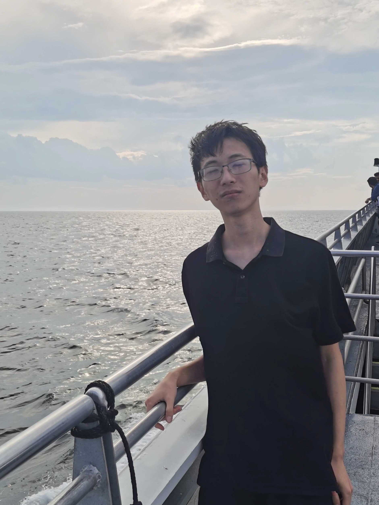

## Course Description

Languages shape how we think.

This course will expand how you think about programming by showing *how languages are built*. We'll demystify so-called "paradigms" -- imperative, object-oriented, and functional -- by distilling them into their core building blocks. You'll come to see familiar languages in a new light, see through surface-level syntax, and choose the right abstractions for the right problems.

More deeply, you'll learn powerful tools used by language designers and theorists to ensure the *correctness* of languages and programs written in them. In a world increasingly flooded with AI-generated slop, this course will sharpen your ability to separate signal from noise and build provably unhackable software, making you irreplaceable in the "AI future".

All this is grounded in hands-on projects. Throughout the session, you'll design and implement a simple but powerful language that unifies seemingly disjoint paradigms and previews next-generation language features.

## Learning Outcomes
By the end of this course, you will be able to:
1. Formalize the syntax and semantics of programming languages from informal description.
2. Visualize and reason about languages and programs written in them using formal models.
3. Implement interpreters and type checkers from formal specifications.
4. Analyze widely held misconceptions about language features and "paradigms", and desugar surface-level features into their essential components.
5. Apply typed functional programming and computational effects to solve problems.
   <!-- 1. Model the data domain with algebraic data types.
   1. Carry out structural recursion (induction) to solve the problem over algebraically defined data.
   2. Identify recurring computational patterns in the solution, and abstract them into higher-order and/or polymorphic functions. -->

## Teaching Team

>  
> 
> 
> **Instructor:** Junrui Liu (pronounced "June-ray", he/him)
> 
> 
> I'm a PhD student in Computer Science (just finished my 4th year). I research Programming Languages, so the stuff we cover in CS 162 is very close to my heart. I've been TA'ing this course for 4 years in a row, and am super excited to teach it for the first time as an instructor!
>
> In my free time, I enjoy watching owarai, anime and competitive Valorant. I also like playing [carillon](https://music.ucsb.edu/participate/ensembles/carillon) (you might catch me practicing on the Storke Tower on weekends this summer).
>
> **Email**: [junrui@ucsb.edu](mailto:junrui@ucsb.edu)
> 
> **Office hours**: Tue, Wed, Thur, 2-3pm, Phelps 2510

>  
> 
>
> **TA:** Jiaming Shan (he/him)
> 
> I'm a first-year CS PhD student in UCSB, advised by Prof. Yu Feng. My current research topic is Programming Language and Formal Verification. I'm currently working on projects on AI for math and smart contracts. I'm also interested in AI. In my leisure time, I play some digital card games and rhythm games.
> 
> **Email**: [jiamingshan@ucsb.edu](mailto:jiamingshan@ucsb.edu)
> 
> **Office hours**: Mon 2-4pm @ [CSIL](https://ucsb-cs48.github.io/topics/csil/) (1st floor of Harold Frank Hall, south side)

The faculty mentor for this course is Prof. Yu Feng (yufeng@cs.ucsb.edu).

In the remainder of this syllabus, "I" refers to Junrui, the instructor, unless otherwise specified.

## Course Communication

We will use Discord for most communication, including announcements and Q&A. The invitation link will be posted on Canvas. Sensitive information will be communicated via email (e.g., if you want to privately inquire about your grade).

## Weekly Pattern

|           | Mon                        | Tue                                             | Wed                                             | Thu                                             | Fri                                             |
| --------- | -------------------------- | ----------------------------------------------- | ----------------------------------------------- | ----------------------------------------------- | ----------------------------------------------- |
| **Class** | No class 🏖️😎                | Lecture 🧑‍🏫   (12:30-1:50pm,   Phleps 2514) | Lecture 🧑‍🏫   (12:30-1:50pm,   Phleps 2514) | Lecture 🧑‍🏫   (12:30-1:50pm,   Phleps 2514) | Section 🗣️   (11am-12:20pm,   Phelps 1440) |
| **OH**    | Jiaming   (2-4pm, CSIL) | Junrui   (2-3pm, Phelps 2510)                | Junrui   (2-3pm, Phelps 2510)                | Junrui   (2-3pm, Phelps 2510)                | My turn   🏖️😎                                 |

## Grading Scale

| Percentage | Letter Grade |
| ---------- | ------------ |
| 93% - 100% | A            |
| 90% - 92%  | A-           |
| 87% - 89%  | B+           |
| 83% - 86%  | B            |
| 80% - 82%  | B-           |
| 77% - 79%  | C+           |
| 73% - 76%  | C            |
| 70% - 72%  | C-           |
| 67% - 69%  | D+           |
| 63% - 66%  | D            |
| 60% - 62%  | D-           |
| 0% - 59%   | F            |

Note that:
- I reserve the right to curve the grades to the student's advantage. In other words, the percentage for each letter may be *lowered* at the end of the session, but will not be raised, so you can always expect to get *at least* the letter grade corresponding to the percentage listed above.
- I have no incentive to enforce a normal, bell-shaped distribution of grades, so you can be assured that you will get the letter grade you deserve based on your *own* performance, not on how well your classmates do.

## Grading Criteria

- 5 homework assignments: 50%
  - A mix of written exercises and programming tasks
- 2 quizzes: 40%
  - Held in class, closed-book, no makeups
  - No quiz will be held during the last week of the session
- 2 reflections: 10%
  - More details in the [Reflection Assignments](#reflection-assignments) section below

## Readings
The primary reference for this course is the lecture notes, which will be made available in the [Lecture Notes](./lecture-notes.md) section of this website. I will try to release the notes within 2-3 days after each lecture.

For additional reference, here're some of my personal favorite textbooks on programming languages, all of which are freely available online:
- [Types and Programming Languages](https://github.com/MPRI/M2-4-2/blob/master/Types%20and%20Programming%20Languages.pdf) by Benjamin C. Pierce
- [Practical Foundations for Programming Languages (2nd Ed)](https://web.archive.org/web/20221109205432/http://www.cs.cmu.edu/~rwh/pfpl/2nded.pdf) by Robert Harper
- [Programming Languages: Application and Interpretation (2nd Ed)](https://cs.brown.edu/courses/cs173/2012/book/) by Shriram Krishnamurthi
<!-- - Frank Pfenning's [lecture notes for 15-814](https://www.cs.cmu.edu/~fp/courses/15814-f21/schedule.html) at CMU -->

## Course Policies

### Attendance
You are highly encouraged to attend both class and section. Although optional, attendance and participation will definitely influence your success level in this class -- not least because you can [earn tokens](#token-system) for active participating!

### Token System

You will receive tokens of my appreciation 💖 for giving me feedback on my teaching -- directly so by filling out surveys, or indirectly so by actively participating in class and coming to my office hours. You can redeem these tokens for **corrections on quizzes**. Each token allows you correct 1 point you lost on a quiz. There is no upper limit on the number of tokens you can earn. 

Below is a tentative and non-exhaustive list of ways to earn tokens:
| Activity                                             | Tokens | Reset         |
| ---------------------------------------------------- | ------ | ------------- |
| Filling out a survey                                 | 2 💖    | every survey  |
| Attending a lecture                                  | 1 💖    | every lecture |
| Asking/answering a question in class                 | 2 💖    | every lecture |
| Coming to Junrui's office hours                      | 2 💖    | every week    |
| Hidden events (explained when an event is triggered) | ??? 💖  | every event   |

The **Reset** column indicates how often the tokens can be earned. For example, you can earn 2 tokens for asking a question in class, but you can only earn that token once per lecture. In other words, the *first* time you ask a question in each lecture grants you 2 tokens. (The resets are intended to prevent hardcore min-maxers from DDoSing me with questions.)

To redeem your tokens for quiz corrections, you will schedule an in-person meeting with Junrui toward the end of the course, during which you will go over your original and corrected answers. More details will be provided later in the course.

"What if I'm shy?"

> Junrui: Same here. As an undergrad, I was terrified of speaking up in class, worried my question might sound “stupid” or my answer might be wrong. So if you're nervous, know it’s totally normal. And if you’re not comfortable talking in class, you can still earn tokens through office hours or surveys.  
>  
> That said, this system is meant to nudge you toward participating more than you normally would. Ultimately, the system is designed to collect *your* feedback on my teaching. I'd much rather know you're confused right away than have you think you're fine, only to realize you're lost during the homework. Honestly, I value questions that reveal misunderstandings as much as correct answers. Think of it like learning an instrument or a sport — it’s better if a coach spots your mistake early, before you practice it the wrong way for too long. I’m your coach for *learning* programming languages, and you're mine for *teaching* them — so the feedback goes both ways.  
>  
> One way to ease the nerves is to treat asking questions as a "min/max" strategy. You paid about [$1200 for this class](https://www.summer.ucsb.edu/cost-savings/cost-attendance) — you deserve the best grade you can earn (with academic integrity, of course). Questions help you earn correction tokens and boost your quiz scores. Even asking me to clarify something I just said counts. Staying quiet earns you 1 token; raising your hand earns you 3!
>  
> So I hope this takes some of the pressure off. There really are no stupid questions — only imagined ones.
>
> 

### Classroom Responsibility and Courtesy
This is a course where lectures will often involve discussions, since language design is inherently a *human* endeavor, and good designs only come from tons of trial and error and cross-pollination from diverse ideas. You are welcome and encouraged to express your own opinions in or after class, but you should expresse them respectfully. Respect fellow students and the hard work of others: in other words, your work must be your work, plagiarism will not be tolerated. 

### Collaboration and Academic Integrity
You are encouraged to work together on homework assignments, but you must write your own code and solutions, unless it's explicitly designed to be a group assignment. 

Academic integrity is taken seriously. If you copy someone else's work (or LLM's work, as detailed in the [GenAI Usage](#genai-usage) section), you will be violating UCSB's [academic integrity policy](https://studentconduct.sa.ucsb.edu/academic-integrity), which will result in a failing grade for the course.

### GenAI Usage
Unless otherwise specified, use of generative AI tools, including but not limited to chatbots (e.g., ChatGPT), coding assistants (e.g., Copilot), and coding agents (e.g., Cursor), is **not allowed** in this course.

"Why not?"

> On the surface, using those tools would be a [violation of UCSB's academic integrity policy](https://studentconduct.sa.ucsb.edu/academic-integrity). I do not want to report anyone -- it will make everyone sad, not just me, but if that happens, I will have no choice but to follow the policy.
> 
> Fundamentally, I want *you* to learn and think deeply about the materials, so that you become irreplaceable by AIs -- not training yet anthoer model for tech billionaires to replace the workers. The only way to gain muscle is to use that muscle. The only way to get good at an instrument is to practice. The only way to learn to speak a new language is to actually speak it. No learning occurs if the work doesn't happen *within you*.
> 
> Also, I respect your work, and I'd appreciate if you respect mine as well. I do not use AI to grade your work at all. If your work is AI generated, it's often easy to tell -- because a lot of the materials in this class are novel -- and I will be very sad to read something not from you. Also, I spent a lot of time designing and crafting this course. Although the materials may not be perfect, I'd greatly appreciate it if you respect my work by not feeding it as training data to some LLM. If something is not clear, please let me know, and I will do my best to make it better.
> 
> On a more cheerful note, you won't ever need them, hopefully.
>    1. You do not need to write any boilerplate code for this class. Every line of code you write matters, and is designed to check your understanding -- think of Gradescope autograder as a personalized TA vetted by me. The entirety of the interpreter + type checker you'll write for the entire class is fewer than 500 lines of code (at least in my own implementation). Spread over 5 assignments, that's about 100-200 LOC per week, which I hope is manageable.
>    2. LLMs are ok with program syntax, and bad with program semantics, because they can't escape the Halting Problem! This course, however, is all about semantics and wreslting with the "undecidable". Even if you only use chatbots as "personalized tutors", they will likely give you non-sensical answers for questions related to language semantics (don't ask how I know this). So if you have questions, I'd highly encourage you to ask me, the TA, or your classmates instead. I and the TA will do our absolute best to help you understand everything taught in this class + get 100% on all assignments, if you're willing to put in the work. Come to office hours, ask questions in class and in Discord, and form study groups.
> 
> **TL;DR.** I want you to learn and succeed. Don't be like this guy:
>
> 

### Late Days

You have a total of **5 late days** to use throughout the course for *programming assignments*. You can spend **no more than 2 late days** on each programming assignment, and you can use them in any combination you like (e.g., 1 day for HW1, 2 days for HW2, 2 days for HW5, etc.). Once you run out of late days, no more late submissions will be accepted, and you will receive a score of 0 for late assignments.

You cannot use late days on the written part of the assignments, since we may discuss the answers in class the next day. 

### Quiz Makeup

No makeups will be given for quizzes except for formally documented emergencies. If you miss a quiz, you will receive a score of 0 for that quiz.

## University Policies

### Copyright and Course Recording
All course materials (class lectures and discussions, handouts, quizzes, web materials) and the
intellectual content of the course itself are protected by United States Federal Copyright Law and the
California Civil Code. [UC Policy 102.23](http://policy.ucop.edu/doc/2710530/PACAOS-100) expressly prohibits students (and all other persons) from recording
lectures or discussions and from distributing or selling course materials without my prior written permission. Students are permitted to make notes solely for their own private educational use. Exceptions to accommodate students with disabilities may be granted with appropriate documentation.

> **TL;DR.** Don't share or sell material from this class with people outside of the course!

### Title IX
Under Title IX, university students are protected from harassment and discrimination based on gender and sex. If a student feels uncomfortable or in need of support at any time related to their gender, sex, and/or sexual orientation, please contact me or your TA immediately. If a student would like to disclose information related to pronouns, name changes, or identities, we encourage you to do so. UCSB's [Resource Center for Sexual and Gender Diversity](https://rcsgd.sa.ucsb.edu/) on the 3rd floor of the Student Resource Building is also available to advocate and support to students

### Disability Accommodations
Students with disabilities may request academic accommodations by contacting the [Disabled Students Program (DSP)](https://dsp.sa.ucsb.edu/). DSP is located at 2120 Student Resource Building and serves as the campus liaison regarding issues and regulations related to students with disabilities.

For exam accommodations, please submit requests at least 1 week before the quiz date, so that I can make the necessary arrangements.

### Other Resources

#### Wellbeing and Mental Health
Personal concerns such as stress, anxiety, relationships, depression, cultural differences, can interfere with your ability to succeed and thrive. If you are experiencing any difficulties meeting class requirements, or any difficulties in your personal life, please contact UCSB Counseling and Psychological Services. For information, please call <a href="tel:805-893-4411">(805) 893-4411</a> or visit [their web site](https://caps.sa.ucsb.edu/). In addition, UCSB has [tons of resources](https://wellbeing.ucsb.edu/) to help you gain the information, skills, and support systems you need to thrive and succeed academically.

#### Basic Needs

If you are facing any challenges securing food or finding housing, you are urged to meet with a [Calfresh Advocate and Basic Needs Peer Advisor](https://basicneeds.ucsb.edu/resources/basic-needs-peer-advising), who is aware of the broad variety of resources that UCSB has to offer. You are also urged to contact me or the TA if you are comfortable doing so. Please visit [basicneeds.ucsb.edu](https://basicneeds.ucsb.edu/) for additional resources including [Calfresh](https://basicneeds.ucsb.edu/resources/food/calfresh), the [AS Food Bank](https://foodbank.as.ucsb.edu/), and more.

## Reflection Assignments

I will share a couple of Youtube videos each week on some aspect of programming languages -- either directly related to what we talked about that week, or some broader topic that might be interesting/important but unfortunately doesn't fit into the short time we have in class.

Out of 6 weeks, you pick 2 weeks to watch the videos and write a short (2-3 paragraphs) reflection on what you learned from the video, what surprised you, what you agreed/disagreed with, how does it change the way you think about programming languages, how does it relate to your own experience, etc.

Completion = full credit. No need to be a great writer. Just share your thoughts in a way that others can understand, be honest and be thoughtful. You're encouraged to share your reflections with the class and comment on other students' reflections, if you feel comfortable doing so.

Again, don't use LLMs. If you do, it'll defeat the purpose of reflections; I and other students will also waste time reading and commenting on some random string of emotionless symbols that doesn't come from *you*. If you're tempted to use LLMs, that likely means the week's topic doesn't interest you. In that case, you can skip it and do it in another week when the topic *does* genuinely interest you, since you only need to choose 2 weeks out of 6 anyway.

## Calendar (Tentative)

|       Date | Topic                                            | Out  | Due  |
| ---------: | ------------------------------------------------ | ---- | ---- |
| **Week 1** | **How to design a programming language?**        |      |      |
|      06/24 | Why study programming languages? + Python review | HW 1 |      |
|      06/25 | Syntax                                           |      |      |
|      06/26 | Inference rules                                  |      |      |
| **Week 2** | **What makes a programming language?**           |      |      |
|      07/01 | Semantics                                        | HW 2 |      |
|      07/02 | Names                                            |      | HW 1 |
|      07/03 | Types                                            |      |      |
| **Week 3** | **How to abstract *data*?**                      |      |      |
|      07/08 | Finite and recursive types                       | HW 3 |      |
|      07/09 | Pattern-matching                                 |      | HW 2 |
|      07/10 | *Quiz 1 (tentative)*                             |      |      |
| **Week 4** | **How to abstract *computation*?**               |      |      |
|      07/15 | Lambda calculus                                  | HW 4 |      |
|      07/16 | Polymorphism, type inference                     |      | HW 3 |
|      07/17 | Defunctionalization, continuation-passing        |      |      |
| **Week 5** | **How to change the world?**                     |      |      |
|      07/22 | Mutable states                                   | HW 5 |      |
|      07/23 | Effect handlers                                  |      | HW 4 |
|      07/24 | *Quiz 2 (tentative)*                             |      |      |
| **Week 6** | **What is the future of programming like?**      |      |      |
|      07/29 | Advanced topic, TBD                              |      |      |
|      07/30 | Advanced topic, TBD                              |      |      |
|      07/31 | Advanced topic, TBD                              |      |      |
|  **08/02** | **(End of summer session A)**                    |      | HW 5 |

<!-- |      07/29 | Curry-Howard correspondence                 |      |      |
|      07/30 | Codata, objects, subtyping, infinity        |      |      |
|      07/31 | It's lambda calculus all the way down!      |      |      | -->
